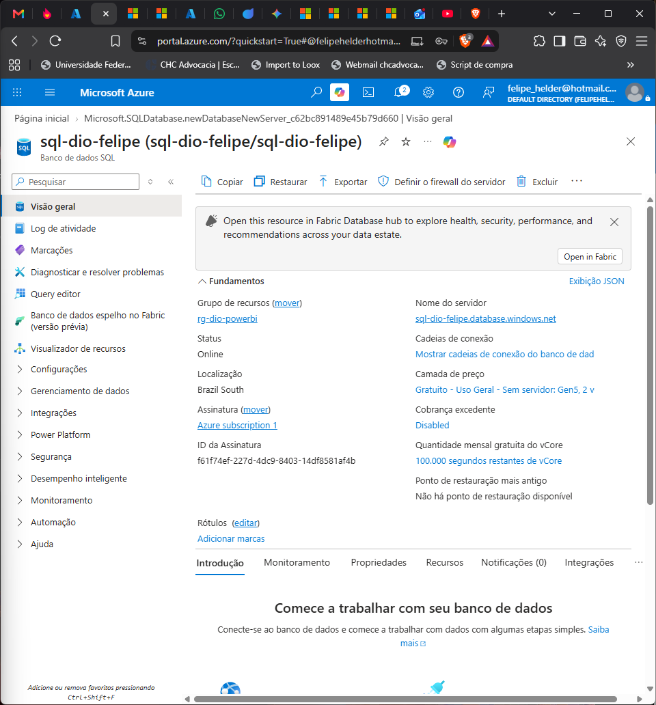
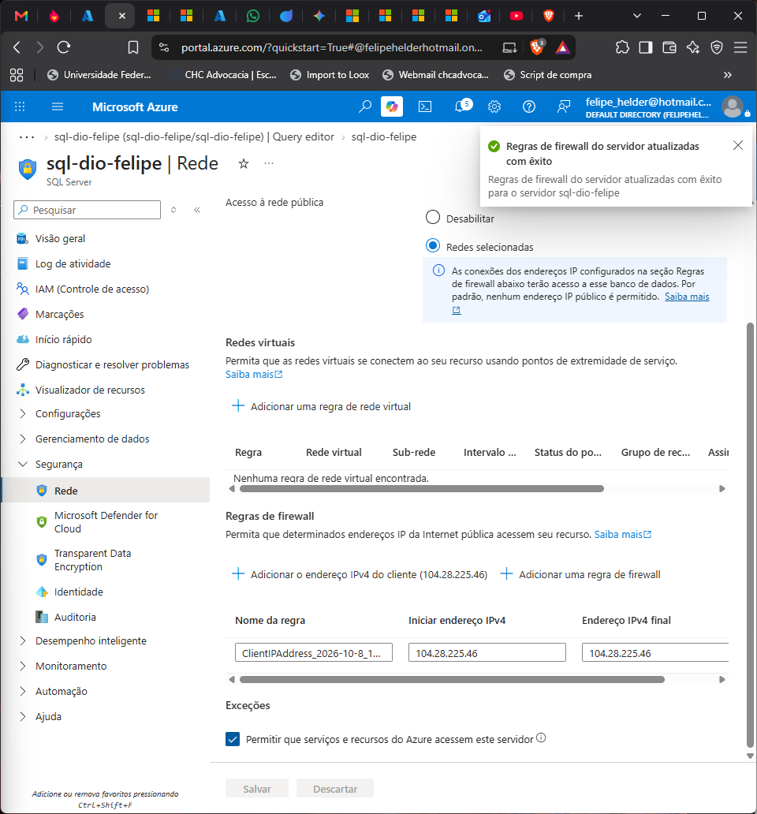
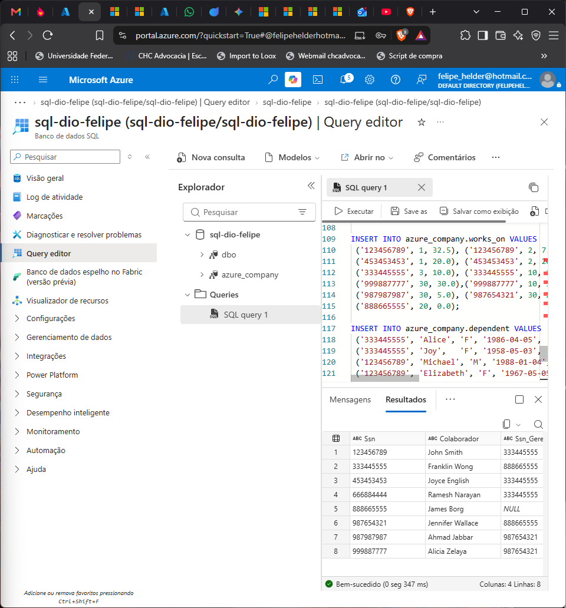
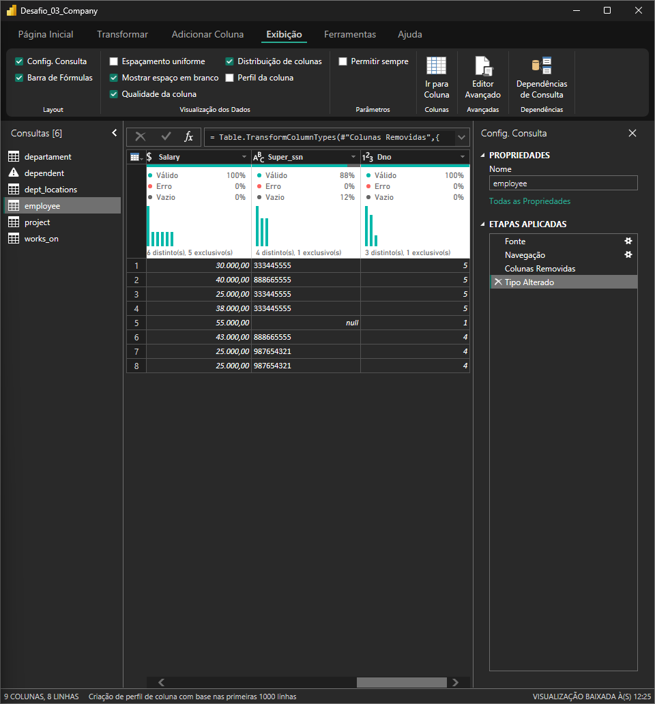
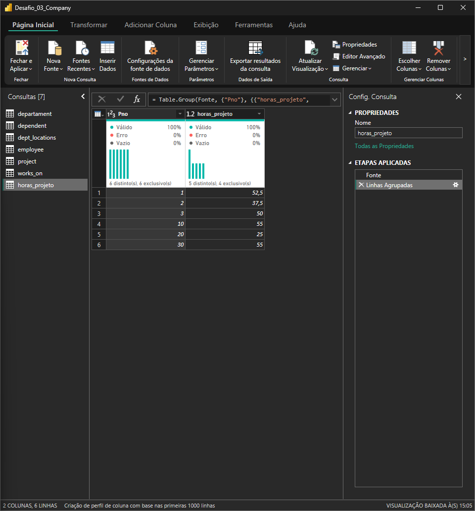
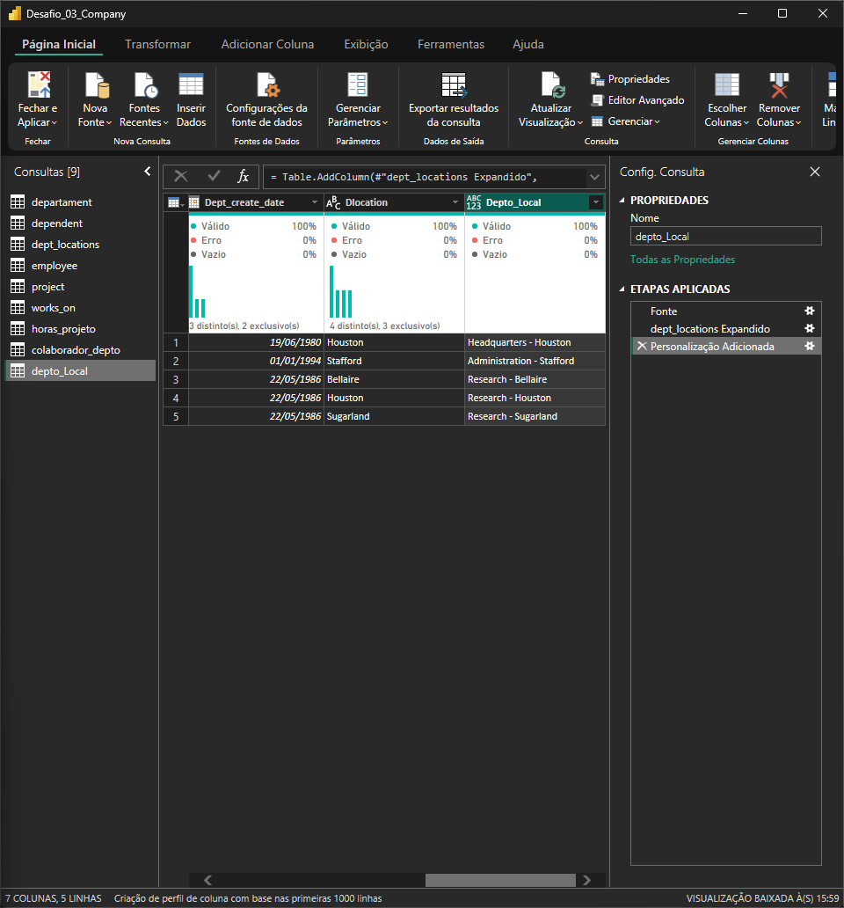
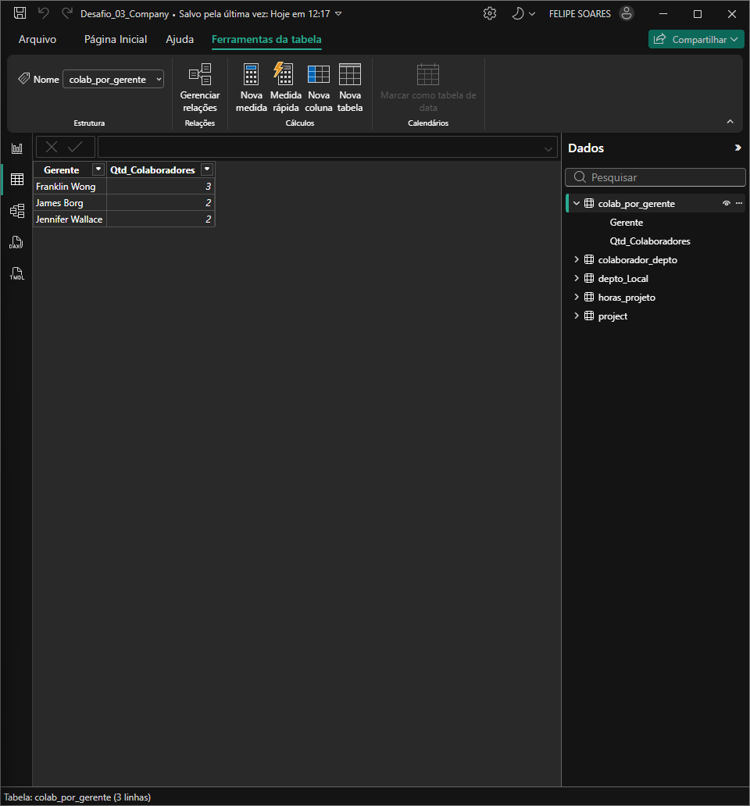

# Desafio 03 – Integrando Dados na Nuvem (Azure SQL) e Transformando com Power BI

Banco **Company** hospedado no **Azure**, conectado ao **Power BI Desktop** e tratado no **Power Query** nas 16 diretrizes do desafio. O resultado foi conferido em um relatório de verificação de 1 página.


---

## 1. Arquitetura

```
Azure SQL Database (Brazil South)            Power BI Desktop
 servidor: sql-dio-felipe                     ├─ Power Query: 16 transformações
 schema:   azure_company (6 tabelas)  ──────► ├─ Modelo: 5 tabelas finais
 firewall: IP do cliente                      └─ Relatório de verificação
```

### Por que Azure SQL Database e não Azure Database for MySQL?
O enunciado sugere o **Azure Database for MySQL**. Optei pelo **Azure SQL Database** por três motivos:
1. **Custo zero garantido:** a oferta gratuita do Azure SQL Database dá 100 mil vCore-segundos e 32 GB por mês, com *cobrança excedente desabilitada*. O MySQL Flexível exige um servidor B1ms ligado, que consome crédito.
2. **Mesmo resultado para o Power BI:** o conector nativo *Banco de dados SQL do Azure* não precisa de driver extra (o MySQL exige o Connector/NET).
3. **Mesmo modelo de dados:** o script foi convertido de MySQL para T-SQL, com as mesmas tabelas, chaves e dados.

| Configuração | Valor |
|---|---|
| Servidor lógico | `sql-dio-felipe.database.windows.net` |
| Região | Brazil South (East US não estava disponível para a assinatura) |
| Autenticação | SQL (usuário admin) |
| Rede | Acesso público em *Redes selecionadas* + regra de firewall para o IP do cliente |
| Modo de conexão no Power BI | Importação |

| Visão geral | Firewall | Script executado |
|---|---|---|
|  |  |  |

---

## 2. Script do banco

Os scripts originais do curso tinham **4 erros** que impediam a execução. Corrigi todos:

| # | Problema no script original | Correção |
|---|---|---|
| 1 | Criação no schema `azure_company` e inserção em `company_constraints` | Schema único `azure_company` |
| 2 | `DROP TABLE dependent` antes de a tabela existir | `DROP TABLE IF EXISTS` |
| 3 | `ALTER TABLE ... DROP departament_ibfk_1` (sintaxe inválida) | FK criada já com nome e regras finais |
| 4 | Inserção de `employee` falha pela auto-referência (`Super_ssn`) | Inserção em ordem hierárquica: diretor → gerentes → equipe |

Na conversão para T-SQL também foi preciso:
- usar `CHAR(1)` no lugar de `CHAR`;
- deixar a FK auto-referente sem `ON DELETE SET NULL`, porque o SQL Server não permite cascata em auto-referência;
- remover os `GO`, que o Editor de Consultas do portal não aceita.

- [`sql/01_script_azure_company_TSQL.sql`](sql/01_script_azure_company_TSQL.sql): script executado no Azure
- [`sql/01_script_azure_company.sql`](sql/01_script_azure_company.sql): versão MySQL corrigida (testada em MariaDB)
- [`sql/02_consultas_analise.sql`](sql/02_consultas_analise.sql): consultas de verificação

**Conferência pós-carga:** employee 8 · departament 3 · dept_locations 5 · project 6 · works_on 16 · dependent 7 linhas.

---

## 3. Transformações no Power Query (16 diretrizes)

| # | Diretriz | O que foi feito | Resultado |
|---|---|---|---|
| 1 | Cabeçalhos e tipos | Removidas as colunas de navegação (`azure_company.*`); códigos (`Ssn`, `Super_ssn`, `Mgr_ssn`, `Essn`) como **Texto**, datas como **Data** | 6 tabelas tipadas |
| 2 | Valores monetários | `Salary` → **Número decimal fixo** | Valores em R$ com 2 casas |
| 3 | Nulos | **Qualidade da coluna** em todas as tabelas | Único nulo: `Super_ssn` (12% = 1 linha) |
| 4 | Colaborador sem gerente | Análise do nulo de `Super_ssn` | **James Borg**, diretor geral. Mantido e rotulado *"Sem gerente (Diretor)"* |
| 5 | Departamento sem gerente | Qualidade da coluna em `Mgr_ssn` | Nenhum: os 3 departamentos têm gerente |
| 6 | Preencher lacunas | Não se aplica | Sem lacunas a preencher |
| 7 | Horas dos projetos | `works_on` → Referência → **Agrupar por** `Pno`, soma de `Hours` | Consulta `horas_projeto`: 6 projetos, **275 h** |
| 8 | Separar colunas complexas | `Address` → Número, Rua, Cidade, Estado via **coluna personalizada em M** | Trata a rua com hífen (`975-Fire-Oak-Humble-TX`) |
| 9 | Mesclar employee + departament | **Mesclar como nova**, `Dno = Dnumber`, **Externa esquerda** (employee como base) | Consulta `colaborador_depto` |
| 10 | Eliminar colunas da mescla | Expandido apenas `Dname` | Só o nome do departamento |
| 11 | Colaborador + gerente | Auto-mescla de `employee`: `Super_ssn = Ssn`, Externa esquerda | Nome do gerente na mesma linha |
| 12 | Nome completo | `[Fname] & " " & [Lname]` (colaborador e gerente) | Colunas `Colaborador` e `Gerente` |
| 13 | Departamento + local | Mesclar `departament` + `dept_locations` (`Dnumber`) e concatenar | Consulta `depto_local`: 5 combinações únicas |
| 14 | Por que mesclar e não atribuir | Ver resposta abaixo | – |
| 15 | Colaboradores por gerente | `colaborador_depto` → Referência → **Agrupar por** `Gerente`, Contar linhas | Consulta `colab_por_gerente` |
| 16 | Remover colunas sem uso | Colunas intermediárias removidas; tabelas-base com **carga desabilitada** | Modelo com 5 tabelas finais |

Qualidade da coluna na `employee` (itens 2 e 3): `Super_ssn` com 12% vazio e `Salary` em decimal fixo.



### M usado no item 8
A divisão automática por `-` quebraria o endereço `975-Fire-Oak-Humble-TX` em 5 partes. A lógica abaixo fixa as pontas (número, cidade, estado) e junta o que sobra como rua:
```m
let p = Text.Split([Address], "-") in
[ Numero = p{0},
  Rua    = Text.Combine(List.Range(p, 1, List.Count(p) - 3), "-"),
  Cidade = p{List.Count(p) - 2},
  Estado = List.Last(p) ]
```

### Item 11: junção colaborador × gerente em SQL
O mesmo resultado da auto-mescla do Power Query, direto no banco:
```sql
SELECT e.Ssn,
       CONCAT(e.Fname, ' ', e.Lname) AS Colaborador,
       e.Super_ssn                   AS Ssn_Gerente,
       CONCAT(g.Fname, ' ', g.Lname) AS Gerente
FROM azure_company.employee e
LEFT JOIN azure_company.employee g ON g.Ssn = e.Super_ssn;
```
O `LEFT JOIN` mantém o James Borg na lista mesmo sem gerente. Com `INNER JOIN` ele seria excluído.

### Item 14: por que **mesclar** e não **atribuir (acrescentar)**?
- **Mesclar (join)** combina tabelas **lado a lado** a partir de uma chave em comum (`Dnumber`). Cada departamento fica ligado às suas localizações **na mesma linha**, e isso permite formar a combinação única *"Research - Houston"*.
- **Acrescentar (append/união)** apenas **empilha linhas** de tabelas com a mesma estrutura. Departamentos e localizações ficariam em linhas separadas, sem relação entre si, e a combinação não existiria.

Resumindo: acrescentar soma **linhas**; mesclar soma **colunas** relacionadas por uma chave.

| Horas por projeto | Departamento + local | Colaboradores por gerente |
|---|---|---|
|  |  |  |

---

## 4. Resultados da verificação

| Indicador | Valor |
|---|---|
| Colaboradores | 8 |
| Departamentos | 3 |
| Projetos | 6 |
| Horas alocadas | 275 |

**Horas por projeto:** Computerization 55 · Newbenefits 55 · ProductX 52,5 · ProductZ 50 · ProductY 37,5 · Reorganization 25

**Colaboradores por gerente:** Franklin Wong 3 · James Borg 2 · Jennifer Wallace 2

**Departamento + local:** Headquarters - Houston · Administration - Stafford · Research - Bellaire · Research - Houston · Research - Sugarland

### Anomalias encontradas
| Anomalia | Tratamento |
|---|---|
| `Super_ssn` nulo para James Borg | Não é erro: ele é o diretor. Rotulado como *"Sem gerente (Diretor)"* |
| James Borg alocado no projeto Reorganization com **0 h** | Mantido e sinalizado (alocação sem horas) |
| Endereço com 5 partes (`Fire-Oak`) | Divisão com M personalizado em vez do delimitador simples |

---

## 5. Modelo final

| Tabela | Origem | Uso |
|---|---|---|
| `colaborador_depto` | employee + departament + employee (gerente) | Tabela de colaboradores |
| `colab_por_gerente` | Agrupamento de `colaborador_depto` | Gráfico por gerente |
| `horas_projeto` | Agrupamento de `works_on` | Gráfico de horas (relacionada 1:1 com `project`) |
| `depto_local` | departament + dept_locations | Combinações departamento-local |
| `project` | Azure SQL | Nome dos projetos |

Medidas DAX:
```DAX
Total Colaboradores = COUNTROWS(colaborador_depto)
Total Departamentos = DISTINCTCOUNT(depto_Local[Dname])
Total Projetos      = COUNTROWS(project)
Total Horas         = SUM(horas_projeto[Total_Horas])
```

---

## 6. Arquivos

| Arquivo | Conteúdo |
|---|---|
| `Desafio_03_Company.pbix` | Relatório Power BI com as consultas |
| `Desafio_03_Company.pdf` | Relatório exportado |
| `sql/` | Scripts T-SQL (Azure), MySQL corrigido e consultas de verificação |
| `prints/` | Evidências do Azure e do Power Query |

> **Custos:** o banco usa a oferta gratuita do Azure SQL Database, com pausa automática e cobrança excedente desabilitada. O firewall libera apenas o IP do cliente. As credenciais não estão versionadas.

---
Autor: **Felipe Helder** · [GitHub](https://github.com/fhelderls) · [LinkedIn](https://www.linkedin.com/in/fhelderls)
