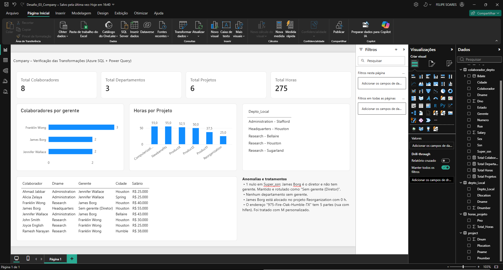
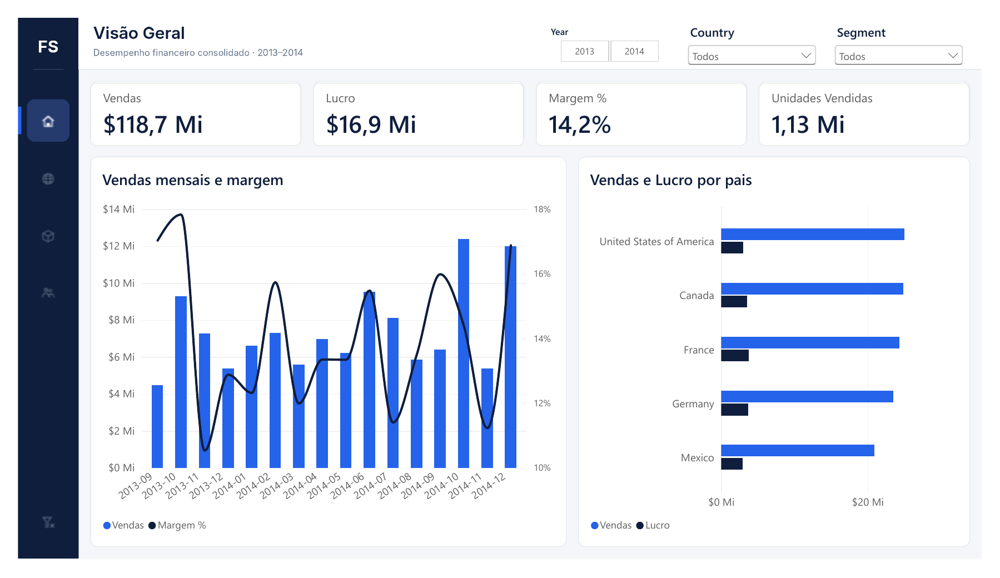
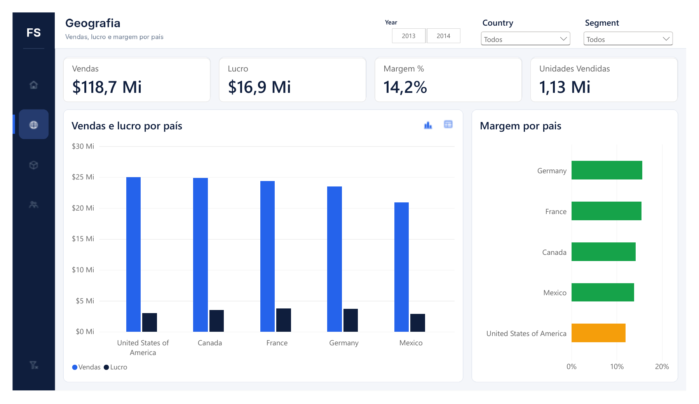
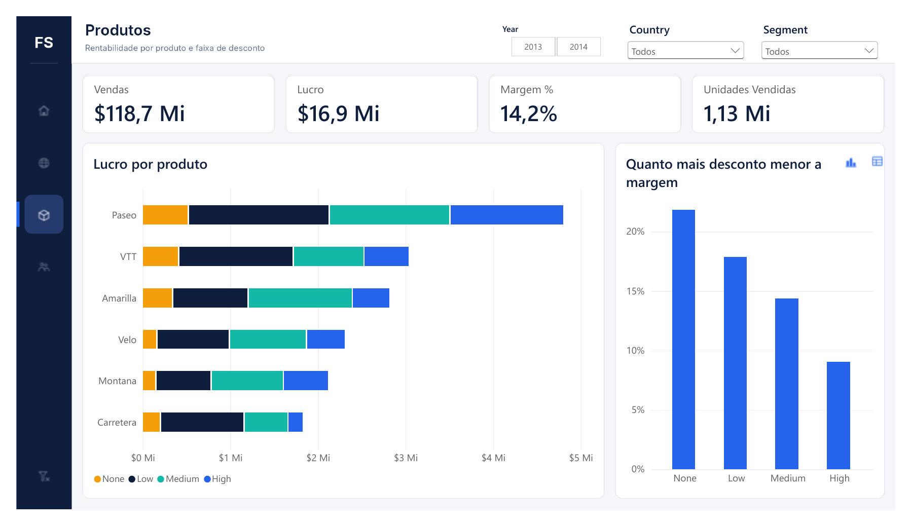
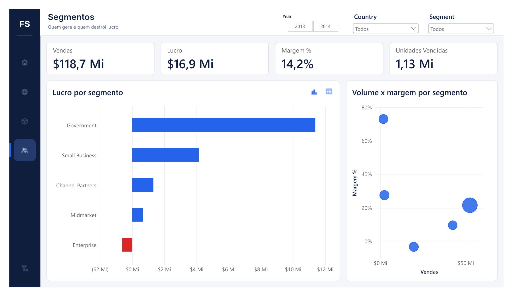

# Desafios Power BI – DIO | Formação Power BI Analyst

Repositório com os desafios de projeto da **Formação Power BI Analyst (DIO)**.

| Desafio | Entrega | Pasta |
|---|---|---|
| 01 – Explorando Dados e Relatórios | Relatório de 1 página (mapas e pizza) | `Desafio_DIO.pdf` |
| 02 – Relatório com navegação, segmentadores e indicadores | Relatório de 4 páginas (Financial Sample) | [`Desafio_02/`](Desafio_02) |
| **03 – Integrando dados na nuvem (Azure SQL) com Power BI** | **Banco Company no Azure + 16 transformações no Power Query** | [`Desafio_03/`](Desafio_03) |

---

## Desafio 03 – Azure SQL + Power Query

Banco **Company** criado no **Azure SQL Database** (oferta gratuita, Brazil South), conectado ao Power BI e tratado nas **16 diretrizes** do desafio: tipagem, nulos, divisão de endereço com M, mesclagens com junção externa esquerda, auto-mescla colaborador × gerente e agrupamentos.

- **4 erros corrigidos** nos scripts SQL originais do curso e conversão MySQL → T-SQL.
- **Achados:** único nulo é o diretor (James Borg), que também está alocado com 0 h em um projeto; endereço com hífen na rua tratado com M personalizado.
- **Resultado:** 8 colaboradores · 3 departamentos · 6 projetos · 275 h.

Detalhes completos em [`Desafio_03/README.md`](Desafio_03/README.md).

---

## Desafio 02 – Relatório Financial Sample

Relatório de 4 páginas com menu lateral de navegação, segmentadores sincronizados e **indicadores (bookmarks) que alternam gráfico ↔ tabela** sobre o mesmo assunto.

### Requisitos do desafio → como foram atendidos
| Requisito | Implementação |
|---|---|
| Estrutura definida | 4 páginas com o mesmo layout (menu lateral, cabeçalho, 4 KPIs, 2 painéis), tela 1280×720 e fundos desenhados para o relatório |
| Botões de navegação | Menu lateral com 4 botões de **imagem** (ícones próprios) com estado padrão e *hover* + botão **Limpar filtros** |
| Segmentadores | Ano (bloco), País e Segmento (lista suspensa), **sincronizados** entre as 4 páginas |
| Indicadores + botões | 6 indicadores (Geografia, Produtos e Segmentos), cada par alternando **gráfico ↔ tabela/matriz**, com "Dados" desmarcado para preservar os filtros do usuário |

### Páginas
| Página | Pergunta de negócio | Visuais |
|---|---|---|
| Visão Geral | Como estão vendas, lucro e margem? | KPIs, vendas mensais × margem, vendas e lucro por país |
| Geografia | Qual país vende mais e qual tem melhor margem? | Colunas ↔ matriz por país, margem por país com cor condicional |
| Produtos | Quais produtos e faixas de desconto dão lucro? | Lucro por produto e desconto, margem por faixa de desconto ↔ mapa de calor |
| Segmentos | Quem gera e quem destrói lucro? | Lucro por segmento (prejuízo em vermelho) ↔ tabela, dispersão volume × margem |

### Principais insights
- **Total:** $118,7 Mi em vendas, $16,9 Mi de lucro, margem de **14,2%**.
- **Government** gera 67% do lucro ($11,4 Mi).
- **Enterprise vende $19,6 Mi e tem prejuízo de –$0,6 Mi** (margem –3%). É o principal alerta do relatório.
- **Desconto corrói margem:** sem desconto 22% → Low 18% → Medium 14% → High 9%.
- **Channel Partners** tem a maior margem (73%), mas volume baixo. É uma oportunidade de crescimento.
- Países equilibrados em vendas ($21–25 Mi); EUA têm a menor margem (12%).
- **Paseo** é o produto líder em vendas e lucro.

### Técnicas utilizadas
- **Power Query:** limpeza do cabeçalho `" Sales"`, tipagem e coluna de ordenação `Ordem Desconto` (evita dependência circular ao classificar `Discount Band`).
- **DAX:** tabela de medidas `_Medidas` com Vendas, Lucro, Margem %, % Desconto, Preço Médio e medidas de **cor condicional** (`Cor Lucro`, `Cor Margem`).
- **Design:** tema JSON próprio, imagens de fundo com o layout, ícones PNG para os botões.
- **Interatividade:** indicadores com escopo de página e visibilidade de visuais, botões de ação e segmentadores sincronizados.

### Arquivos
| Arquivo | Conteúdo |
|---|---|
| `Desafio_02/Desafio_02_Financial.pbix` | Relatório Power BI |
| `Desafio_02/Desafio_02_Financial.pdf` | Relatório exportado |
| `Desafio_02/medidas.dax` | Medidas DAX |
| `Desafio_02/tema_financial.json` | Tema do relatório |
| `Desafio_02/fundos/`, `Desafio_02/icones/` | Fundos de página e ícones dos botões |
| `Desafio_02/GUIA_PASSO_A_PASSO.md` | Passo a passo de construção |
| `Desafio_02/dados/Financial_Sample.xlsx` | Base de dados |

### Observação técnica
O visual de **Mapa (Bing)** está em descontinuação no Power BI e o **Azure Maps** depende de liberação do administrador do locatário. Por isso a página Geografia usa colunas + matriz, mantendo a análise por país sem depender de mapas.

---
Autor: **Felipe Helder** · [GitHub](https://github.com/fhelderls) · [LinkedIn](https://www.linkedin.com/in/fhelderls)
